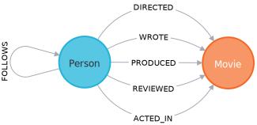
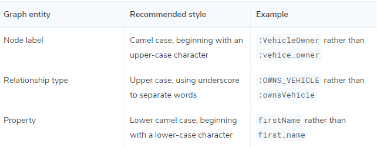

# Parte 1 - Neo4j Experiment


## Objetivo
Nesta etapa, o objetivo é entender o banco de dados Neo4j, que é um banco de dados não relacional (NoSQL) que usa estruturas de grafos. Para isto, será criado um banco de dados seguindo os [tutoriais dados pelo proprio site do Neo4J](https://neo4j.com/developer/cypher/guide-cypher-basics/).
O importante é que no final, os seguintes conhecimentos sejam adquiridos:
- [ ] Criação de BD com Neo4J
- [x] Modo em que cada Entidade é representado
- [x] Modo em que cada relacionamento é representado
- [x] Modo que propriedades das entidades é representado
- [x] Entender o básico de Cypher Query

### Instalação
A instalação do Neo4J se encontra no seguinte [link](https://neo4j.com/download/). Antes de fazer o download, precisa preencher o formulario e o download se inicia automaticamente. Também é disponibilizado um pdf do livro "Graph Databases"

### Neo4j
Para mexer com Neo4J, vê-se a necessidade de aprender Cypher
#### Cypher
Cypher é a linguagem de query de grafo utilizada pelo Neo4j. Uma query cypher tem a seguinte aparencia
```
Match(m:Movie) where m.release > 2000 Return m limit 5
```
Esta query recupera todos os filmes no banco de dados que lançaram depois do ano 2000, limitando o resultado a 5 filmes

Com esta database tutorial de filmes, testaremos alguns exercicíos de criação de query

1. Criar query que recupera todos os filmes lançados após o ano de 2005
    ```
    Match(m:Movie) where m.released > 2005 RETURN m
    ```

2. Criar query que retorna a quantidade de filmes lançados depois do ano de 2005
    ```
    Match(m:Movie) where m.released > 2005 RETURN count(m)
    ```
Logo, podemos entender que o comando MATCH serve para buscar um dado no db. Logo, a forma basica de MATCH é a seguinte:
```
    MATCH <pattern>
    WHERE <conditions>
    RETURN <expressions>        
```


### Nós e Relações
As estruturas do banco de dados são representadas atraves de nós e de relações entre os nós



#### Nós
Nós representam entidades. Um nó seria similar a uma fileira em um banco de dados relacional.
No projeto tutorial de Neo4j (*Movies Project*) temos dois nós, o de Person e o de Movies. Em cypher query, um nó é contido entre parênteses - como `(p:Person)`, onde p é a variável e Person é o nó que está sendo referido

#### Relações
Dois nós podem estar conectados com um relacionamento. No caso do projeto tutorial, Person se relaciona com Movie atraves das relações *ACTED_IN*, *REVIEWED*, *PRODUCED*, *WROTE* e *DIRECTED*.
Em cypher query, relações são contidas em colchetes, como `[w:WORKS_FOR]`, onde w é uma variável e *WORKS_FOR* é o tipo de relacionamento que esta está se referindo.
Dois nós podem estar conectados por mais de um relacionamento. 

Uma busca na database por relacionamento teria a seguinte aparencia:
```
    MATCH (p:Person)-[d:DIRECTED]-(m:Movie) where m.released > 2010 RETURN p,d,m
```
Esta query tem como objetivo retornar todas as pessoas que dirigiram um filme que lançou depois de 2010.
Tendo isso em mente, testaremos alguns exercicios de query:
1. Query que retorne todas as pessoas que atuaram em um filme lançado depois de 2010
    ```
    MATCH (p:Person)-[a:ACTED_IN]-(m:Movie) where m.released > 2010 RETURN p,a,m
    ```
### Labels
Nas queries de cypher, Labes são prefixadas com dois pontos, como *:Person* ou *:ACTED_IN*.
Para atribuir um label de nó para uma variável basta prefixar a variável a Label, como (p:*Person*), que significa que p indica nós com a label de *Person*.

Labels são usados quando se quer realizar operações apemas em tipos específicos de nós.
Uma operação do tipo
```
MATCH (p:Person) RETURN p limit 20
```
retonaria no maxímo 20 itens do nó de Pessoas, enquanto a operação do tipo
```
MATCH (n) RETURN n limit 20
```
retornaria no maxímo 20 itens de todos nós

### Propriedades
Propriedades são pares de nomes e valores usados para adicionar atributos para nós e relações

Para retornar propriedades especificas de um nó, pode-se escrever 
```
MATCH (m:Movie) return m.title, m.realeased
```
O resultado dessa query é o nó de Movies, com apenas o valor das propriedades titulo e data de lançamento. 
Tendo isso em mente, o tutorial sugere o seguinte exercício
1. Escreva uma query que retorna as propriedades nome e data de nascimento do nó de Person
    Resposta:
    ```
    Match (p:Person) return p.name,p.born
    ```

### Criar um Nó

A cláusula de criação pode ser usada para criar um novo Nó ou relacionamento
```
CREATE (p:Person {name: 'John Doe'}) return p
```
O comando gera um novo nó com a propriedade *name* tendo o valor de 'John Doe'
Tendo isso em mente, o tutorial sugere o seguinte exercicio:

1. Criar um novo nó de Person com a propriedade *name* tendo o valor do seu nome
Resposta:
    ```
    CREATE (p:Person {name:'<Colocar o nome aqui>'}) RETURN p
    ```

### Achar nó com cláusulas *MATCH* e *WHERE*

A cláusula *MATCH* é usada para achar nós que correspondem à um certo padrão. 

Na maioria dos casos, *MATCH* é usado com certas condições para restringir o resultado.
```
MATCH(p:Person {name: 'Tom Hanks'}) RETURN p
```
Esta é uma das formas de fazer, embora só dê para fazer filtragens simples baseadas em correspondência de *string* desta forma (sem usar *WHERE*)
Outra forma seria usar uma cláusula *WHERE* que permite filtragem mais complexas incluindo > , <, *Starts With*, *Ends With*, etc

```
MATCH(p:Person) WHERE p.name = "Tom Hanks" Return p
MATCH(p:Person) WHERE p.name STARTS WITH 'Tom' Return p
MATCH(p:Person) WHERE p.name ENDS WITH 's' Return p
```
Tendo isso em mente, testaremos alguns exercicios de query:
1. Achar o filme com o título "*Cloud Atlas*"
    Resposta:
    ```
    MATCH (m:Movie {title:'Cloud Atlas'}) RETURN m
    ```
2. Filtrar todos os filmes que tenham lançado entre 2010 e 2015
    Resposta:
    ```
    MATCH (m:Movie) WHERE m.released > 2010 AND m.released < 2015 RETURN m
    ```

### Merge de Cláusulas

Merge de cláusulas é usado tanto para
1. Corresponder nós existentes e liga-los ou
2. Criar novos nós e liga-los
É a combinação de *MATCH* e *CREATE* e adicionalmente permite especificar ações adicionais caso a data tenha sido correspondida ou criada
```
MERGE (p:Person {name: 'John Doe'})
ON MATCH SET p.lastLoggedInAt = timestamp()
ON CREATE SET p.createdAt = timestamp()
Return p
```
A query irá criar o nó de Pessoa se ele já não existir. Se o nó já existir, então irá definir a propriedade *lastLoggedInAt* ao timestamp atual. Se o nó não existir e for criado no momento, então irá definir a propriedade *CreatedAt* ao timestamp atual
Tendo isso em mente, testaremos alguns exercicios de query:

1. Escreva uma query utilizando *Merge* para criar um nó Movie com o título "*Greyhouse*". Se o nó não existir, então define a propriedade released para 2020 e lastUpdatedAt para o atual timestamp. Se o nó já existir, então apenas define a propriedade lastUpdatedAt ao timestamp atual. No fim, retorna o nó do filme.
Resposta:
    ```
    MERGE (m:Movie {title: 'Greyhouse'}) 
    ON MATCH SET m.lastUpdatedAt = timestamp()
    ON CREATE SET m.lastUpdatedAt = timestamp(), m.released = 2020
    RETURN m
    ```

### Criar um Relacionamento
Um relacionamento conecta dois nós
```
MATCH (p:Person), (m:Movie)
WHERE p.name = "Tom Hanks" and m.title = "Cloud Atlas"
CREATE (p)-(w:WATCHED)->(m)
Return type(w)
```
A query cria o relacionamento :*WATCHED* entre nós de pessoa e filme existentes e retorna o tipo de relacionamento (ou seja, *WATCHED*)
Tendo isso em mente, testaremos alguns exercicios de query:
1. Criar um relacionamento :*WATCHED* entre o nó de pessoa com o valor nome = "your name" e o filme com título "Cloud Atlas" e então retorna o tipo de relacionamento criado
```
MATCH (p:Person), (m:Movie)
WHERE p.name = "your name" and m.title="Cloud Atlas"
CREATE (p)-[w:WATCHED]->(m)
RETURN type(w)
```

#### Tipos de Relacionamentos
Em Neo4j,existem dois tipos de relacionamentos - ***incoming*** e ***outgoing***


Na imagem acima, o nó de Tom Hanks é mostrado tendo um relacionamento ***outgoing*** enquanto o nó de *Cloud Atlas* é mostrado tendo um relacionamento ***incoming*** 

Relacionamentos sempre terão uma direção. Entretanto, só precisamos prestar atenção para a direção onde é útil.

Para denotarmos uma relação ***outgoing*** ou a relação ***ingoing*** em cypher, usamos -> ou <- 

```
MATCH (p:Person)-[r:ACTED_IN]->(m:Movie) RETURN p,r,m
```
Nessa relação, Person tem um relacionamento ***outgoing*** e Movie tem um relacionamento ***ingoing***

Para o dataset de filmes, a direção do relacionamento não é tão importante e mesmo sem a denotar a direção na query, o valor retornado irá ser o mesmo. Logo a query
```
MATCH (p:Person)-[r:ACTED_IN]-(m:Movie) RETURN p,r,m
```
irá retornar o mesmo resultado da query anterior.

1. Criar uma query para achar os nós Person e Movie que estão conectados pelo relacionamento *REVIEWED*, que é *outgoing* do nó Person e *ingoing* para o nó Movie
```
MATCH (p:Person)-[r:REVIEWED]-(m:Movie) RETURN p,r,m
```

### Queries avançadas de Cypher
Outras questões que podem ser resolvidas com queries cypher (baseada na DB de Filmes de teste)
1. Achar quem dirigiu o filme *'Cloud Atlas'*
    ```
    MATCH (m:Movie {title: 'Cloud Atlas'})<-[d:DIRECTED]-(p:Person) return p.name
    ```
Como o relacionamente é outgoing do nó Person, o simbolo <- é necessario na query

2. Achar todas as pessoas que co-atuaram com Tom Hanks em qualquer filme
    ```
    MATCH (t:Person {name: "Tom Hanks"})-[:ACTED_IN]->(:Movie)<-[:ACTED_IN]-(p:Person) return p.name
    ```

3. Achar todas as pessoas relacionadas(de todas as formas) com o filme Cloud Atlas
    ```
    MATCH(p:Person)-[relatedTo]-(m:Movie{title: "Cloud Atlas"}) return p.name, type(relatedTo)
    ```
Na query, usa-se apenas a variável relatedTo que irá tentar achar todos os relacionamentos entre qualquer nó Person e o nó Movie de "*Cloud Atlas*" 

4. Achar Filmes e atores que estão a três pulos de distância de Kevin Bacon
    ```
    MATCH(p:Person{name: 'Kevin Bacon'})-[*1..3]-(hollywood) return DISTINCT p, hollywood
    ```
Nesta query, hollywood se refere a qualquer nó no banco de dados (neste caso, tanto os nós Person e Movie, além dos adicionados durante o teste, mas não documentados, tipo FaBase)

### Comandos uteis de Cypher

1. `CALL db.schema.visualization` : retorna os nós(esquema) e os relacionamentos que os ligam

2. Convenção de Nomes 

    

3. Deletar Todo o banco de dados
    ```
    MATCH (n) DETACH DELETE n
    ```

4. Verifica Banco de dados
    ```
    MATCH (n) RETURN n
    ```

5. Cláusula *REMOVE*
    
    A clausula *REMOVE* é usada para remover propriedades e labels de elementos do grafo
    ```
    MATCH (soren {name: 'Soren'})
    REMOVE soren.age
    RETURN soren
    ```

6. Cláusula *DELETE*
    
    A cláusula *DELETE* é usada para deletar nós e relacionamentos identificados dentro de uma cláusula *MATCH*, possivelmente qualificada por um *WHERE*. 
    **Não se pode deletar um nó sem tambem deletar relacionamentos que começam OU teminam no nó**
    ```
    MATCH (n)-[r]-()
    WHERE n.name = 'Soren'
    DELETE r
    ```

7. Cláusula *CREATE INDEX*

    A cláusura *CREATE INDEX ON* vai criar e popular a index em uma propriedade para todos os nós que tiverem a label (o index será a propriedade que irá definir o nó(elemento) ).
    
    ***VERIFICAR O [LINK](https://neo4j.com/docs/cypher-manual/current/administration/indexes-for-search-performance/#administration-indexes-introduction)***
    
    (forma atual)
    ```
    CREATE INDEX [optionalName] FOR (p:Person) ON (p.name)
    ```

    (forma descontinuada)

    ```
    CREATE INDEX ON :Person(name)
    ```

8. Cláusula *DROP INDEX ON*
    
    A cláusura *DROP INDEX ON* irá derrubar o index em todos os nós com a label
    ```
    DROP INDEX ON :Person(name)
    ```

9. `CREATE CONSTRAINT ON (movie:Movie) ASSERT movie.title IS UNIQUE`

### Referências
* [Tutorial: Getting Started with Cypher](https://neo4j.com/developer/cypher/guide-cypher-basics/)
* [Neo4j - Overview](https://www.tutorialspoint.com/neo4j/neo4j_overview.htm)
* [Getting Started](https://neo4j.com/developer/get-started/)
* [Setting up a go-neo4j ecosystem](https://medium.com/@angadsharma1016/optimizing-go-neo4j-concurrency-patterns-810dff25f88f)
* [Challenges of neo4j at the heart of software](https://dev.to/l04db4l4nc3r/challenges-of-neo4j-at-the-heart-of-software-2dbi)
* [GraphAcademy Online Training](https://neo4j.com/graphacademy/online-training/)
* [Indexes for search performance](https://neo4j.com/docs/cypher-manual/current/administration/indexes-for-search-performance/#administration-indexes-introduction)
* [Getting started with neo4j in 10 minutes](https://towardsdatascience.com/getting-started-with-neo4j-in-10-minutes-94788d99cc2b)