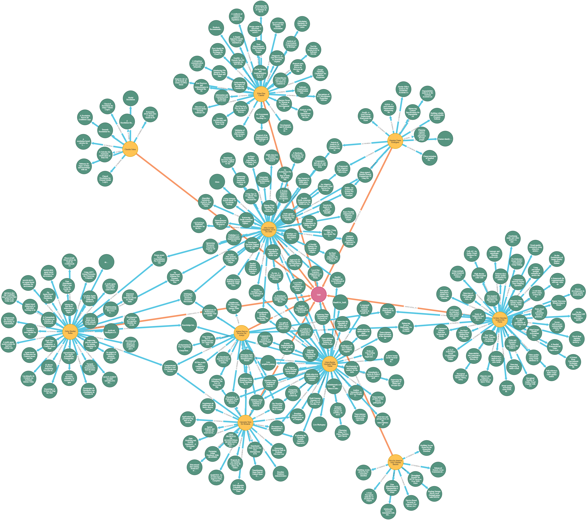
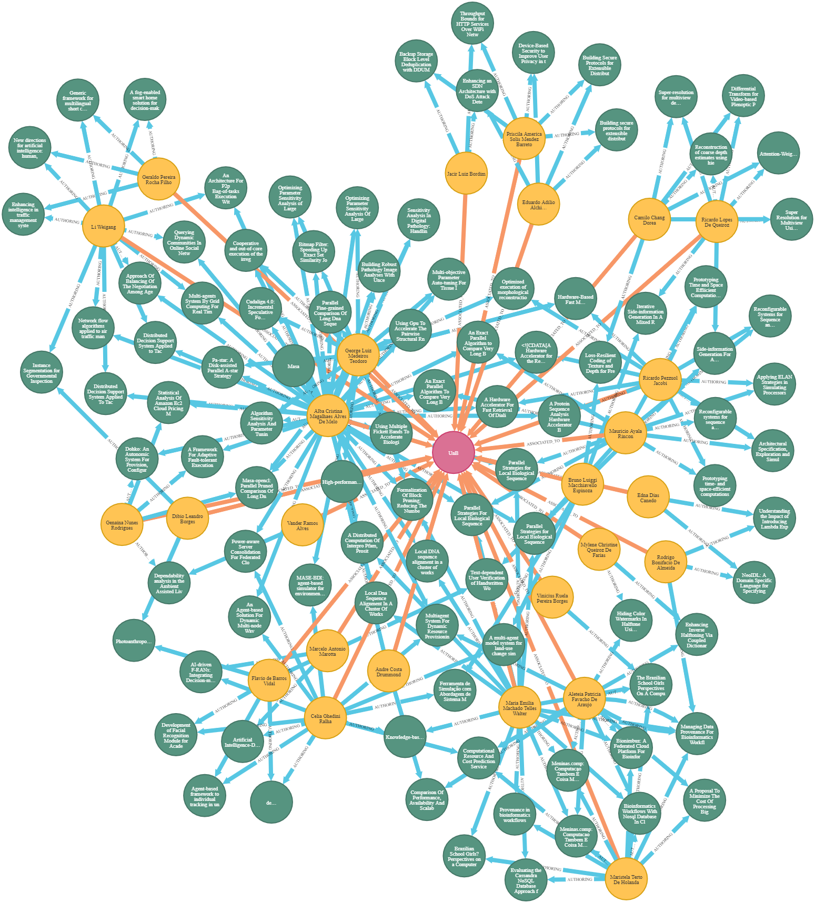
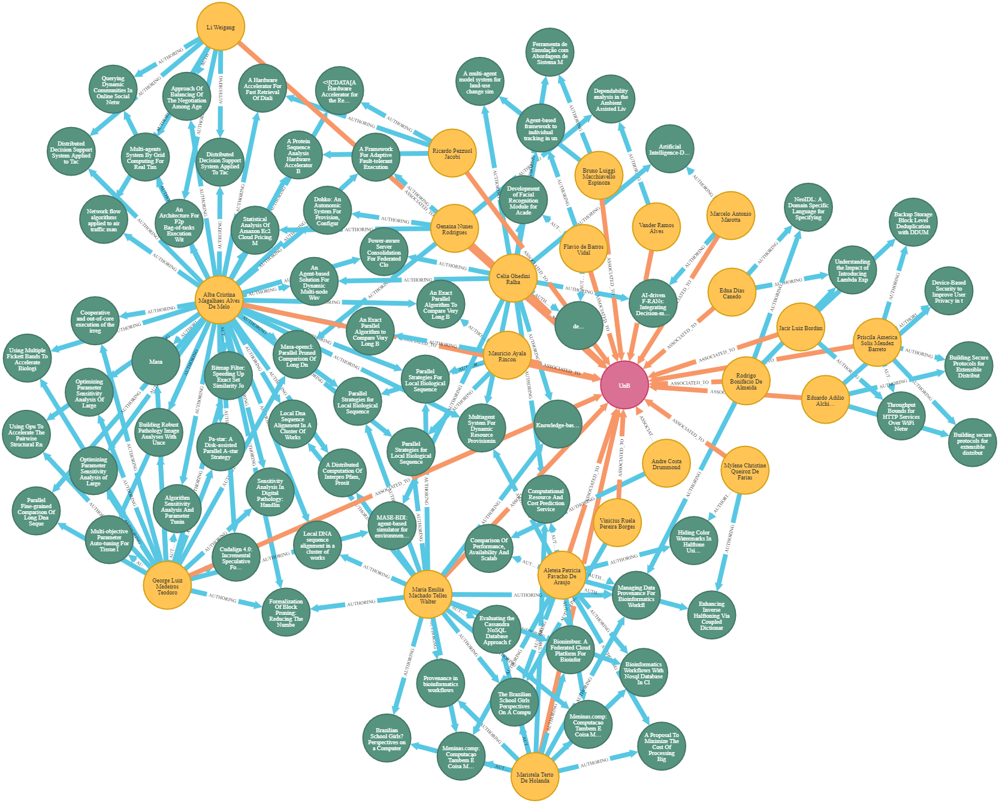
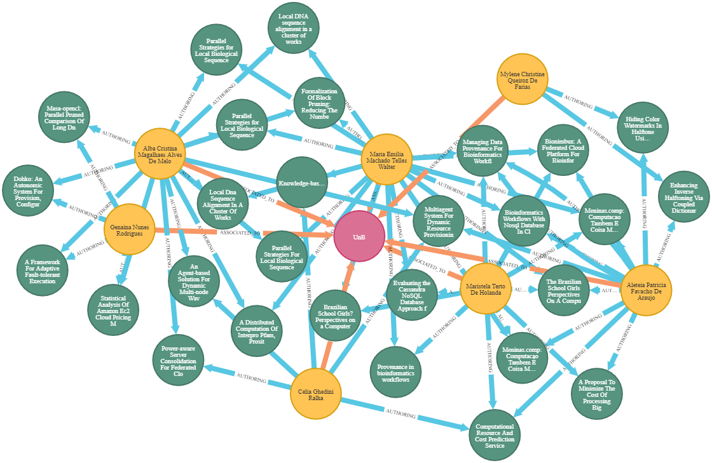
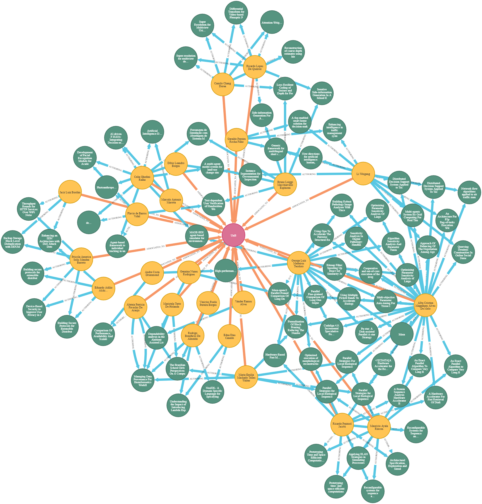
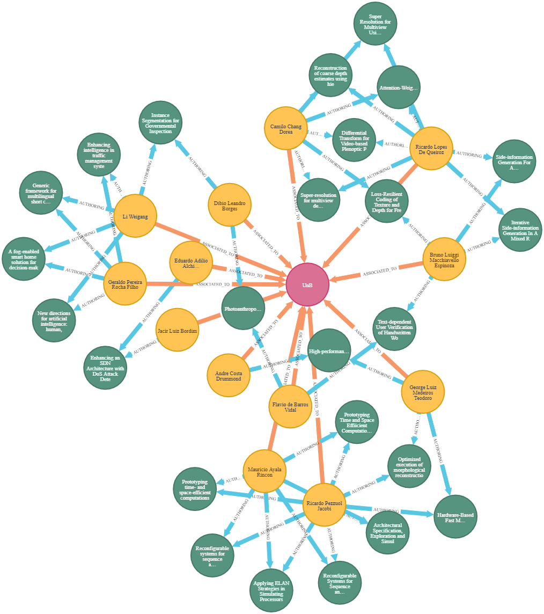
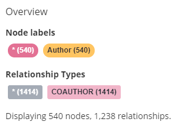
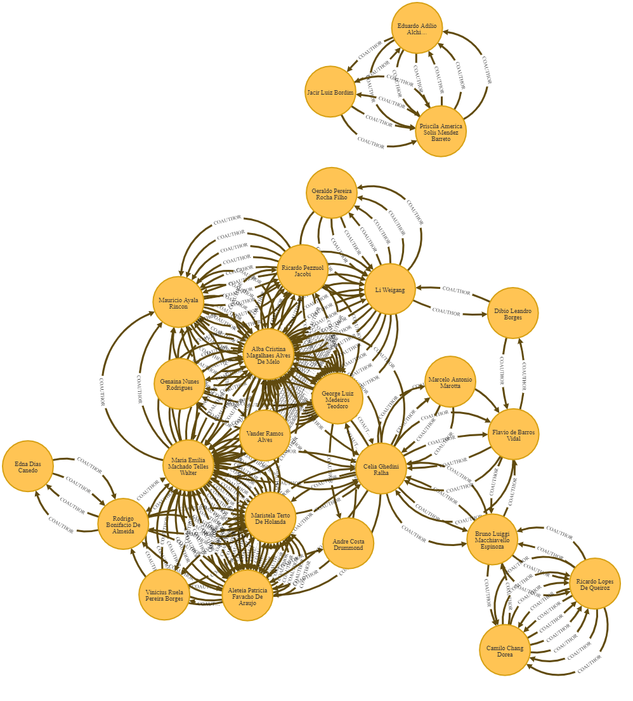
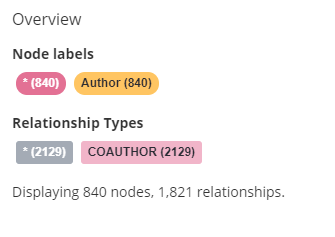

# Parte 3 - Respostas


## Objetivos

- [X] Criar queries para as seguintes perguntas
    - Como é a rede de colaboração feminina e masculina (unb-unb e unb-externo)? 
    - Se a rede feminina é semelhante a masculina visualmente
    - Achar o avarage degree feminino e masculino
    - Mostrar os pesquisadores apenas homens e apenas mulheres

## Progresso das Respostas

- [X] Mostrar apenas pesquisadoras mulheres (e suas pesquisas) e apenas homens (e suas pesquisas)
- [X] Rede de colabolação interna
- [X] Rede de colabolação externa
- [X] Obter rede de colabolação masculina e feminina
- [X] Avarage Degree feminina/ masculina

## Pensamentos para criar as queries

1.  Mostrar apenas pesquisadores unb

    Primeiro achamos como associar professores à Unb e mostrar suas pesquisas


    ```
    MATCH (p:Paper)<-[rs:AUTHORING]-(a:Author)-[r:ASSOCIATED_TO]-(i:Institution {name: 'UnB'}) return a,p,i,rs,r
    ```
    Gerando o seguinte grafo:
    

    Agora precisamos separar por genero

    ```

    MATCH (p:Paper)<-[rs:AUTHORING]-(a:Author{gender:"F"})-[r:ASSOCIATED_TO]-(i:Institution {name: 'UnB'}) return a,p,i,rs,r

    MATCH (p:Paper)<-[rs:AUTHORING]-(a:Author{gender:"M"})-[r:ASSOCIATED_TO]-(i:Institution {name: 'UnB'}) return a,p,i,rs,r

    ```

    Grafos gerados por autores Homens:
    

    Grafos gerados por autoras mulheres:
    
    
    
    Iremos excluir co-autores que tem um relacionamento

    Sem co-autores do genero oposto da unb:
    ```
    MATCH (co:Author)-[rco:AUTHORING]-(p:Paper)<-[rs:AUTHORING]-(a:Author{gender:"F"})-[r:ASSOCIATED_TO]-(i:Institution {name: 'UnB'}) WHERE NOT (co{gender:"M"})-[:ASSOCIATED_TO]-(:Institution) return a,p,i,rs,r,co,rco

    MATCH (co:Author)-[rco:AUTHORING]-(p:Paper)<-[rs:AUTHORING]-(a:Author{gender:"M"})-[r:ASSOCIATED_TO]-(i:Institution {name: 'UnB'}) WHERE NOT (co{gender:"F"})-[:ASSOCIATED_TO]-(:Institution) return a,p,i,rs,r,co,rco
    ```

    Grafos gerados por autores Homens:
    

    Grafos gerados por autoras mulheres:
    


    Com co-autores do genero oposto da unb:

    ```
    MATCH (co:Author)-[rco:AUTHORING]-(p:Paper)<-[rs:AUTHORING]-(a:Author{gender:"M"})-[r:ASSOCIATED_TO]-(i:Institution {name: 'UnB'}) return a,p,i,rs,r,co,rco

    MATCH (co:Author)-[rco:AUTHORING]-(p:Paper)<-[rs:AUTHORING]-(a:Author{gender:"F"})-[r:ASSOCIATED_TO]-(i:Institution {name: 'UnB'}) return a,p,i,rs,r,co,rco
    ```

    Grafos gerados por autores Homens:
    

    Grafos gerados por autoras mulheres:
    


2. Rede de colabolação interna

    Geral:
    ```
    MATCH (co:Author)-[rco:AUTHORING]-(p:Paper)<-[rs:AUTHORING]-(a:Author)-[r:ASSOCIATED_TO]-(i:Institution {name: 'UnB'}) WHERE (co)-[:ASSOCIATED_TO]-(:Institution) return a,p,i,rs,r,co,rco

    MATCH (n)-[r:COAUTHOR]-(a) WHERE (n)-[:ASSOCIATED_TO]-(:Institution) and (a)-[:ASSOCIATED_TO]-(:Institution) return a,n,r
    ```
    


    Só de mulheres:
    ```
    MATCH (co:Author)-[rco:AUTHORING]-(p:Paper)<-[rs:AUTHORING]-(a:Author{gender:"F"})-[r:ASSOCIATED_TO]-(i:Institution {name: 'UnB'}) WHERE (co)-[:ASSOCIATED_TO]-(:Institution) return a,p,i,rs,r,co,rco

    MATCH (co:Author)-[rco:AUTHORING]-(p:Paper)<-[rs:AUTHORING]-(a:Author{gender:"F"})-[r:ASSOCIATED_TO]-(i:Institution {name: 'UnB'}) WHERE (co{gender:"F"})-[:ASSOCIATED_TO]-(:Institution) return a,p,i,rs,r,co,rco
    ```
    F-geral
    
    
    F-F
    


    (periodicos)22 autores - 9 mulheres, 238 relacionamentos

    (trabalhos) 25 autores - 9 mulheres, 776 conexões

    Só de homens:
    ```
    MATCH (co:Author)-[rco:AUTHORING]-(p:Paper)<-[rs:AUTHORING]-(a:Author{gender:"M"})-[r:ASSOCIATED_TO]-(i:Institution {name: 'UnB'}) WHERE (co)-[:ASSOCIATED_TO]-(:Institution) return a,p,i,rs,r,co,rco

    MATCH (co:Author)-[rco:AUTHORING]-(p:Paper)<-[rs:AUTHORING]-(a:Author{gender:"M"})-[r:ASSOCIATED_TO]-(i:Institution {name: 'UnB'}) WHERE (co{gender:"M"})-[:ASSOCIATED_TO]-(:Institution) return a,p,i,rs,r,co,rco

    MATCH (n{gender:'M'})-[r:COAUTHOR]-(a) WHERE (n)-[:ASSOCIATED_TO]-(:Institution) and (a)-[:ASSOCIATED_TO]-(:Institution) return a,n,r
    ```
    M-geral
    
    
    M-M
    


    (periodicos) 25 nós - 17 M - 262 conexões
    (trabalhos) 28 autores - 19 homens - 884 conexões

3. Rede de colabolação externa
    Talvez seja a mesma coisa do grafo de autores separados por genero sem co-autores da unb

    Sem co-autores do genero oposto da unb:
    ```
    MATCH (co:Author)-[rco:AUTHORING]-(p:Paper)<-[rs:AUTHORING]-(a:Author{gender:"F"})-[r:ASSOCIATED_TO]-(i:Institution {name: 'UnB'}) WHERE NOT (co{gender:"M"})-[:ASSOCIATED_TO]-(:Institution) return a,p,i,rs,r,co,rco

    MATCH (co:Author)-[rco:AUTHORING]-(p:Paper)<-[rs:AUTHORING]-(a:Author{gender:"M"})-[r:ASSOCIATED_TO]-(i:Institution {name: 'UnB'}) WHERE NOT (co{gender:"F"})-[:ASSOCIATED_TO]-(:Institution) return a,p,i,rs,r,co,rco
    ```

    Grafos gerados por autores Homens:
    

    Grafos gerados por autoras mulheres:
    

4.  Rede de colaboração total f/m
- F :
    ```
    Match (a:Author{gender:'F'})-[r:COAUTHOR]-(co:Author) WHERE (a)-[:ASSOCIATED_TO]-(:Institution) return a,r,co
    ```
    
    

- M :
    ```
    Match (a:Author{gender:'M'})-[r:COAUTHOR]-(co:Author) WHERE (a)-[:ASSOCIATED_TO]-(:Institution) return a,r,co
    ```
    
    
5. Primeiro, cria-se relação COAUTHOR que relaciona coautores a autores com a pesquisa como campo titulo. Isso irá criar apenas coautores externos a instituição

    ```
    MATCH (co:Author)-[rco:AUTHORING]-(p:Paper)<-[rs:AUTHORING]-(a:Author)-[r:ASSOCIATED_TO]-(i:Institution {name: 'UnB'}) CREATE (co)-[rn:COAUTHOR{title: p.title}]->(a) return a,p,i,rs,r,co,rco,rn
    ```
    
    

Average Degree = Numero de relacionamentos/ numero de nós 

Filtramos os nós pelas pesquisas seguintes:
    
- Filtrar nós relacionados a UnB (Os nós de pesquisa)

    ```
    Match (a:Author{gender:' '})-[r:ASSOCIATED_TO]-(i:Institution) return a
    ```

- Filtrar relacionamentos de coautores

    ```
    MATCH (a:Author{gender:' '})-[c:COAUTHOR]-(co:Author) Where (a)-[:ASSOCIATED_TO]-(:Institution) return a,co,c
    ```
- Filtrar relacionamentos de pesquisas 
    ```
    Match (a:Author{gender:' '})-[r:AUTHORING]-(p:Paper) where (a)-[:ASSOCIATED_TO]-(:Institution{name:'UnB'}) RETURN a,r,p
    ```

    Periodicos:

    |                   | Feminino | Masculino |
    |-------------------|----------|-----------|
    | Nós               | 10       | 21        |
    | Coautores         | 1414     | 2129      |
    | Pesquisas         | 256      | 523       |
    | Average coautores | 141,4    | 101,38    |
    | Average pesquisa  | 25,6     | 24,9      |


## Queries finais para cada pergunta


1. Pesquisa: 
```
MATCH (p:Paper)<-[rs:AUTHORING]-(a:Author{gender:" "})-[r:ASSOCIATED_TO]-(i:Institution {name: 'UnB'}) return a,p,i,rs,r
```
2. Rede de colabolação interna: 

```
MATCH (n{gender:' '})-[r:COAUTHOR]-(a) WHERE (n)-[:ASSOCIATED_TO]-(:Institution) and (a)-[:ASSOCIATED_TO]-(:Institution) return a,n,r
```

3. Rede de colabolação externa:
```
MATCH (n{gender:' '})-[r:COAUTHOR]-(a) WHERE (n)-[:ASSOCIATED_TO]-(:Institution) and not (a)-[:ASSOCIATED_TO]-(:Institution) return a,n,r
```
4. Rede de Colaboração Geral:
```
MATCH (n{gender:' '})-[r:COAUTHOR]-(a) WHERE (n)-[:ASSOCIATED_TO]-(:Institution) return a,n,r
```
5. Criação de Coautores: 
```
MATCH (co:Author)-[rco:AUTHORING]-(p:Paper)<-[rs:AUTHORING]-(a:Author)-[r:ASSOCIATED_TO]-(i:Institution {name: 'UnB'}) CREATE (co)-[rn:COAUTHOR{title: p.title}]->(a) return a,p,i,rs,r,co,rco,rn
```
6. Ver Grafo: 
```
MATCH (n) RETURN n
```