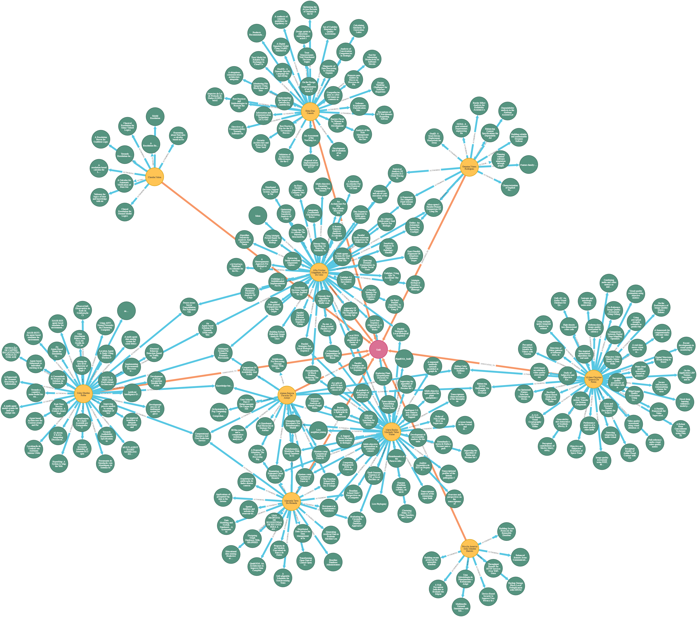

# Parte 3 - Respostas


## Objetivos

- [ ] Criar queries para as seguintes perguntas
    - Como é a rede de colaboração feminina e masculina (unb-unb e unb-externo)? 
    - Se a rede feminina é semelhante a masculina visualmente
    - Achar o avarage degree feminino e masculino
    - Mostrar os pesquisadores apenas homens e apenas mulheres

## Progresso das Respostas

- [X] Mostrar apenas pesquisadoras mulheres (e suas pesquisas) e apenas homens (e suas pesquisas)
- [ ] Rede de colabolação interna
- [ ] Rede de colabolação externa
- [ ] Obter rede de colabolação masculina e feminina
- [ ] Avarage Degree feminina/ masculina

## Pensamentos para criar as queries

1.  Primeiro achamos como associar professores à Unb e mostrar suas pesquisas

    ```
    MATCH (p:Paper)<-[rs:AUTHORING]-(a:Author)-[r:ASSOCIATED_TO]-(i:Institution {name: 'UnB'}) return a,p,i,rs,r
    ```
    Gerando o seguinte grafo:
    

    Agora precisamos separar por genero

    ```

    MATCH (p:Paper)<-[rs:AUTHORING]-(a:Author{gender:"F"})-[r:ASSOCIATED_TO]-(i:Institution {name: 'UnB'}) return a,p,i,rs,r

    MATCH (p:Paper)<-[rs:AUTHORING]-(a:Author{gender:"M"})-[r:ASSOCIATED_TO]-(i:Institution {name: 'UnB'}) return a,p,i,rs,r

    ```

    Grafos gerados por autores Homens:
    

    Grafos gerados por autoras mulheres:
    
    
    
    Iremos excluir co-autores que tem um relacionamento

    Sem co-autores do genero oposto da unb:
    ```
    MATCH (co:Author)-[rco:AUTHORING]-(p:Paper)<-[rs:AUTHORING]-(a:Author{gender:"F"})-[r:ASSOCIATED_TO]-(i:Institution {name: 'UnB'}) WHERE NOT (co{gender:"M"})-[:ASSOCIATED_TO]-(:Institution) return a,p,i,rs,r,co,rco

    MATCH (co:Author)-[rco:AUTHORING]-(p:Paper)<-[rs:AUTHORING]-(a:Author{gender:"M"})-[r:ASSOCIATED_TO]-(i:Institution {name: 'UnB'}) WHERE NOT (co{gender:"F"})-[:ASSOCIATED_TO]-(:Institution) return a,p,i,rs,r,co,rco
    ```

    Grafos gerados por autores Homens:
    

    Grafos gerados por autoras mulheres:
    


    Com co-autores do genero oposto da unb:

    ```
    MATCH (co:Author)-[rco:AUTHORING]-(p:Paper)<-[rs:AUTHORING]-(a:Author{gender:"M"})-[r:ASSOCIATED_TO]-(i:Institution {name: 'UnB'}) return a,p,i,rs,r,co,rco

    MATCH (co:Author)-[rco:AUTHORING]-(p:Paper)<-[rs:AUTHORING]-(a:Author{gender:"F"})-[r:ASSOCIATED_TO]-(i:Institution {name: 'UnB'}) return a,p,i,rs,r,co,rco
    ```

    Grafos gerados por autores Homens:
    

    Grafos gerados por autoras mulheres:
    


2.
3.
4.
5.

## Queries finais para cada pergunta

1.
2.
3.
4.
5.
